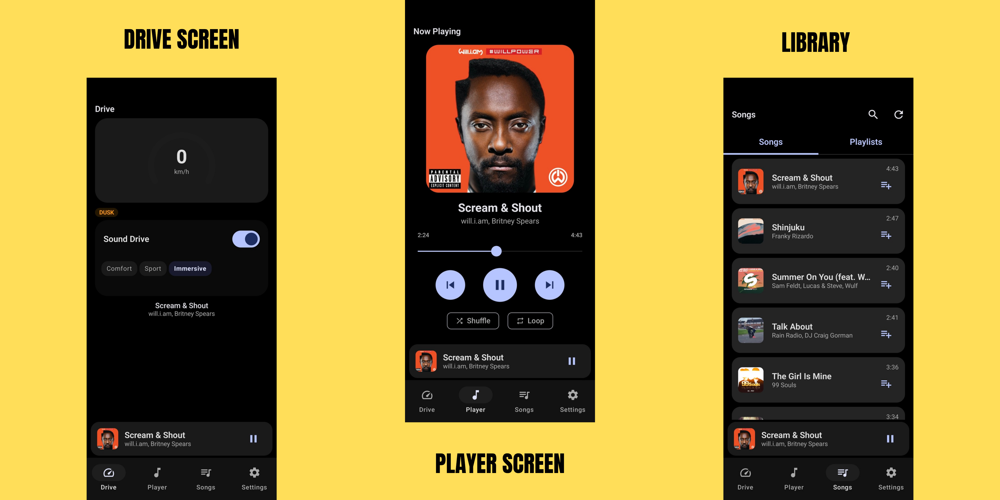

<div align="center">

# 🎧 MotionSound

### Your music, driven by the road.

Your favorite tracks are split into **vocals, bass, drums & melody** right on your
phone — then reshaped by how you move. Accelerate and the layers build. Glide into
a corner and the sound opens up around you. Stop, and it settles back into a quiet
bed of bass and drums.

**v1.0.0** · Android 14+ · 100% on-device AI

[](https://github.com/ngocthanhgl/MotionSound/releases)
[]()
[]()



</div>

---

## ✨ What it does

| | |
|---|---|
| 🧠 **Real-time stem separation** | Every song is split into Vocals, Bass, Drums & Melody on the phone itself — no cloud, no uploads, no waiting. |
| 🏎️ **Movement-reactive mixing** | The mix responds to acceleration, braking, cornering and speed from your phone's sensors. |
| 🎛️ **3 driving mixes** | *Balanced* — smooth and subtle · *Dynamic* — playful and energetic · *Immersive* — full-bodied and wide. |
| ⚡ **Gesture moments** | Hard launch, hard brake, a sharp corner or a rough bump — each triggers its own musical reaction. |
| 🎤 **Beat-locked vocals** | Vocals fade in and out on the beat, never chopped mid-phrase. |
| 🧭 **Fullscreen drive dashboard** | Glanceable speed, driving state, road feel & mix status — with auto enter/exit at speed. |

## 🚀 Start here (important!)

MotionSound analyzes each song **once** and caches the stems — so the magic is
instant from then on. To make sure everything is ready:

1. Open the **Playlist** tab and create a playlist (e.g. *"Highway"*, *"City"*).
2. Add your favorite tracks to it — ❤️ long tracks or full albums work great.
3. Pre-separation starts automatically in the background — watch the cache fill up
   for each song. ⏳ First play from a cold cache may take a moment while stems render.
4. Hit play — and drive. 🚗

You can also play songs directly without a playlist, but pre-caching them first via a
playlist gives you **instant** starts and a seamless, gapless drive.

> 💡 Start with **3–5 songs** so your playlist fits comfortably on disk (see below).

## 🎼 What you'll hear

| Movement | Sound |
|---|---|
| 🟢 Standing still | Quiet bed of bass & drums, muffled like a backstage hum |
| ⚡ Accelerating | Layers stack up one by one — drums first, then bass, melody, vocals |
| 🌀 Cornering | The music widens — stereo space, warm echo, synth shimmer |
| 🔴 Braking | Layers gently fall back; the texture calms down |
| 🛣️ Rough road | Subtle tremolo ripple follows the surface |
| 🌙 Night drive | Everything eases back, softer across the board |

## 📱 Device requirements

| | |
|---|---|
| 📱 Android | **14 (API 34)** or newer |
| 🧠 Recommended | 6 GB+ RAM, a modern mid-to-high-end chip (Snapdragon 7xx/8xx, Dimensity 8xxx, or Apple-class cores) |
| ⚠️ Low-end / older devices | Stem separation is heavy — expect **much slower** first-time analysis, or it may not complete at all. Torch songs (~3–4 min) typically take a few minutes on capable hardware. |
| 💾 Storage | **~250 MB per song** — stems are stored as lossless 32-bit float (4 separate tracks: drums, bass, melody, vocals), so a 3–4 minute track costs roughly 250 MB on disk. Plan your playlists accordingly — a 10-song drive playlist ≈ 2.5 GB. |

> 🚀 If your device struggles, stick to short playlists and separate songs in
> advance (step 3 above) — playback itself stays light.

## 🚦 Drive safely

MotionSound is designed to be **glanced at, not read**. Keep your attention on the road —
use voice or the buttons on your headset. **Never interact with the app while driving.**

## 📲 Get the app

Grab the latest APK from [Releases](https://github.com/ngocthanhgl/MotionSound/releases).

- **arm64-v8a** (most modern phones) or **armeabi-v7a** (older devices)
- First launch needs permissions: **Music & audio**, **Notifications**, **Location** (used only for drive speed, optional)
- The AI model (~160 MB) downloads automatically on first use

## 🎵 Player essentials

- 📂 Browse your **Music & Playlists** tabs, search included
- 🔀 Shuffle / 🔁 Loop
- 🔊 Separate volume sliders for Vocals / Bass / Melody / Drums
- 📡 Full media notification: play, pause, next, prev — works with the screen off
- 🎧 Auto-pause when headphones unplug — auto-resume when they're back

## 🛠 Build it yourself

```
git clone https://github.com/ngocthanhgl/MotionSound
# open in Android Studio (compileSdk 35, Java 17) and run on any arm64 device
```

Releases are built automatically on tag push — an APK lands on the release page in minutes.

## 📝 Disclaimer

An experimental audio player built for fun and curiosity. Use responsibly, at safe
speeds, and with your ears 😉